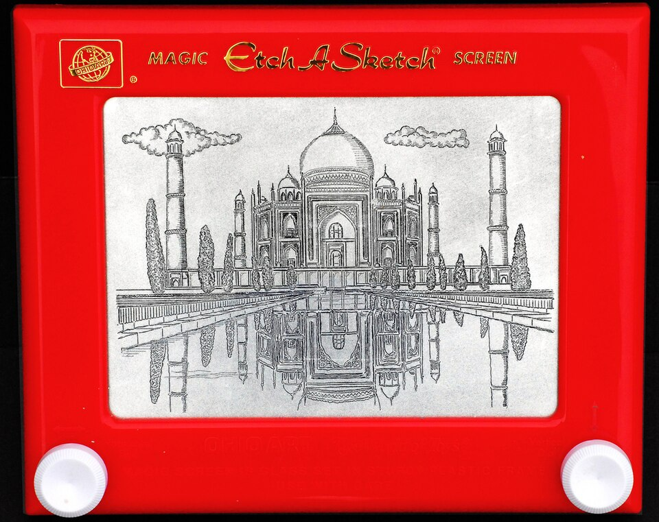
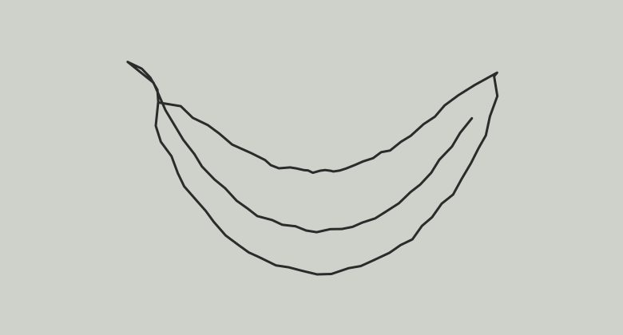
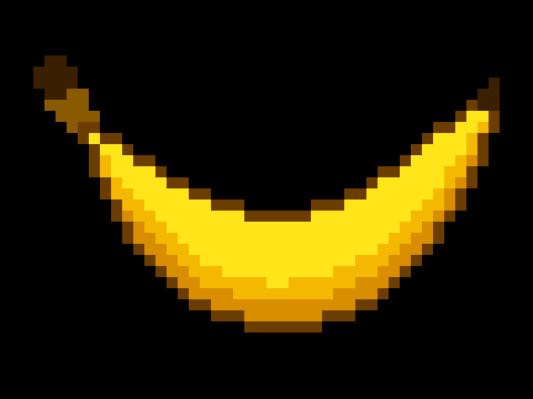

# Stretch a Sketch: project plan

*Draw a rough line. The AI stretches it into 90s pixel art.*

PSAM 5600 B, Fall 2026. Device: TrimUI Brick Pro. Co-author: Claude Sonnet 5.5 (via Claude Code).

## Idea

An Etch A Sketch for a retro Linux handheld. Draw with the two joysticks, and the app turns every sketch into 90s video-game pixel art. The buttons let you customize the look.

The Brick Pro is a game handheld with no drawing tool and no AI. This project makes it do something it was never meant to do, using the two sticks the way an Etch A Sketch uses its two knobs. The output is the kind of art the handheld's own games are made of.

Like the toy, you draw one continuous line and can't lift the pen. The AI has to make sense of that single wiggly line, and that limit is part of the fun.

### What it looks like

<table>
<tr>
<td align="center"></td>
<td align="center"></td>
<td align="center"></td>
</tr>
<tr>
<td align="center"><b>1. The toy</b><br>Two knobs, one line</td>
<td align="center"><b>2. A rough scribble</b><br>What you draw</td>
<td align="center"><b>3. What the app makes</b><br>90s pixel art</td>
</tr>
</table>

These are illustrations of the idea, not output from this project. The scribble and the pixel banana are mock-ups made for this plan.

## Customizing with the buttons

The app always makes 90s-style pixel art, and the buttons change how it looks:

- **Palette.** For example classic 16 colors, a green handheld look, or bright arcade colors.
- **Pixel size.** Chunky 8-bit or finer 16-bit.
- **Outline and shading.** Turn the dark outline and the shading tones on or off.
- **Subject.** A single sprite, an item, or a small scene.
- **Background.** Black, a flat color, or transparent.

## How it works

```
 Brick Pro                 Oracle cloud node            Gemini
 ---------                 -----------------            ------
 sticks draw a sketch --> receives the sketch  -->  redraws it as
 buttons pick options      builds the prompt         pixel art
 shows the result     <--  cleans up the image  <--
```

1. **Handheld app.** A small native app. Left stick moves the pen horizontally, right stick vertically. Buttons change the options, send the sketch, and clear the screen.
2. **Node server.** Runs on my Oracle cloud node. It receives the sketch, writes a prompt that asks for 90s pixel art in the chosen options, calls Gemini, and sends the image back. The API key stays on the node.
3. **Gemini.** Google's image model redraws the sketch.
4. **Pixel cleanup.** The node shrinks the result to a low-resolution grid and limits it to the chosen palette, so every picture has the same crisp pixel look even if the model's output is not perfectly pixelated. This is planned, not built yet.
5. **Own language model (later).** Once the node hosts its own model, it will turn the button choices into a richer prompt.

The node and the handheld are both arm64, so code built on the node runs on the handheld.

## What the node does

- **Relay.** The handheld sends the sketch to the node, the node calls Gemini and returns the image. This keeps the API key off the device and lets the node add the prompt, clean up the image, cache results, and rate-limit requests.
- **Build machine.** The handheld app is written and compiled on the node.
- **Own model (later).** A small language model hosted on the node will write richer prompts from the button choices.

## Build and deploy

1. Write and compile the app on the node (arm64).
2. Copy it to my laptop, then onto the handheld's SD card (card-reader USB mode, or SSH once I can reach the device).
3. Launch it from the Brick Pro's stock menu. I run this step myself.

Both machines are arm64, but the handheld runs an older Linux than the node, so a program built on the node may need its libraries bundled or linked statically. A tiny "hello world" test through the same pipeline comes first, to prove it works before building the real app.

## Steps

1. Drawing canvas prototype on my laptop.
2. Node server that turns a sketch into pixel art, including the cleanup step.
3. Get the app running on the Brick Pro.
4. Connect the handheld to the node, end to end.
5. Add the button options, and the self-hosted model on the node.
6. Documentation, license, and a tagged release.

## Prior art

Turning a sketch into an AI image is not new. Phone and web tools like [Krea](https://www.krea.ai/apps/sketch-to-image), [Scribble Diffusion](https://creati.ai/ai-tools/scribble-diffusion/), SketchAI and Canva already do it. I could not find one that runs on a retro Linux handheld, draws with two joysticks, always outputs 90s pixel art, or uses a model hosted on the user's own node.

Related work:

- [TekaSketch](https://www.yankodesign.com/2025/10/01/this-diy-raspberry-pi-camera-turns-your-photos-into-automated-etch-a-sketch-art/) turns photos into Etch A Sketch drawings, the opposite direction.
- [SandSketch](https://forum.v1e.com/t/sandtable-etch-a-sketch/42882) drives a sand table with the two sticks of a controller.
- [trimui-brick-chrome](https://github.com/vhu231/trimui-brick-chrome) runs Chrome on the Brick Pro. It is a foundation others could build on, not what this project does.

## Image credits

- The toy (Etch A Sketch with a Taj Mahal drawing): "Taj Mahal drawing on an Etch-A-Sketch" by Etcha, [CC BY-SA 3.0](https://creativecommons.org/licenses/by-sa/3.0), via [Wikimedia Commons](https://commons.wikimedia.org/wiki/File:Taj_Mahal_drawing_on_an_Etch-A-Sketch.jpg). Etch A Sketch is a trademark of its owner.
- Banana scribble and pixel banana: made for this project.

## Attribution

All work is co-authored with Claude Sonnet 5.5 (via Claude Code). Commits carry `Co-Authored-By:` trailers, and session transcripts are kept.
